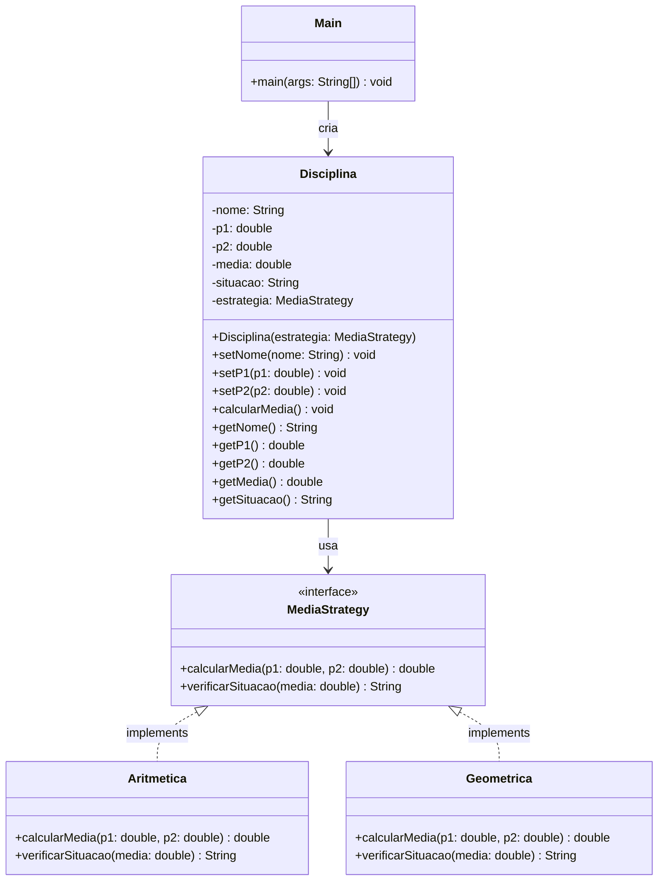

# Design Pattern Strategy

---

## Sumário

1. [Revisão: Design Patterns](#1-revisão-design-patterns)
2. [O Pattern Strategy](#2-o-pattern-strategy)
3. [Comparação com Outros Patterns](#3-comparação-com-outros-patterns)
4. [Implementação em Java](#4-implementação-em-java)
5. [Atividade Prática](#5-atividade-prática)
6. [Dicas de Implementação](#6-dicas-de-implementação)
7. [Entrega](#7-entrega)
8. [Referências Complementares](#8-referências-complementares)

---

## 1. Revisão: Design Patterns

### Relembrando os Conceitos

Nas aulas anteriores, estudamos dois padrões fundamentais:

- **Singleton**: Um padrão **criacional** que garante uma única instância de uma classe
- **Facade**: Um padrão **estrutural** que simplifica interfaces complexas

Agora vamos explorar o **Strategy**, um padrão **comportamental** que trata de como objetos interagem e distribuem responsabilidades.

### Classificação por Propósito

Relembrando a classificação dos 23 padrões do GoF:

- **Padrões Criacionais**: Como criar objetos (ex: Singleton, Factory, Builder)
- **Padrões Estruturais**: Como compor objetos e classes (ex: Facade, Adapter, Decorator)
- **Padrões Comportamentais**: Como objetos interagem (ex: **Strategy**, Observer, Command)

---

## 2. O Pattern Strategy

### Definição

O padrão **Strategy** é um padrão comportamental que permite definir uma família de algoritmos, encapsular cada um deles e torná-los intercambiáveis. O Strategy permite que o algoritmo varie independentemente dos clientes que o utilizam.

> **Analogia do Mundo Real**: Pense em diferentes formas de ir ao trabalho: carro, ônibus, bicicleta ou a pé. Você escolhe a estratégia (meio de transporte) baseado em fatores como distância, clima, tempo disponível e custo. Cada estratégia tem sua própria implementação, mas todas alcançam o mesmo objetivo: chegar ao destino.

### Quando usar?

Use o Strategy quando:

- Você tem **múltiplas variações de um algoritmo** e precisa alternar entre elas
- Você quer **evitar condicionais complexas** (`if-else` ou `switch`) para selecionar comportamentos
- Você precisa de **algoritmos intercambiáveis** em tempo de execução
- Quer **isolar a lógica de negócio** das implementações específicas de algoritmos
- Deseja aplicar o **princípio Open/Closed** (aberto para extensão, fechado para modificação)

### Exemplos de Uso Real

1. **Sistema de Pagamento**
   - Cliente escolhe: Cartão de Crédito, PayPal, Boleto ou Pix
   - Cada forma de pagamento tem sua própria lógica de processamento
   - O sistema de checkout não precisa conhecer os detalhes de cada método

2. **Compressão de Arquivos**
   - Usuário seleciona: ZIP, RAR, 7Z ou TAR.GZ
   - Cada algoritmo de compressão tem sua implementação específica
   - A interface de compressão permanece a mesma independente do algoritmo

3. **Validação de Dados**
   - Sistema valida: CPF, CNPJ, E-mail ou Telefone
   - Cada tipo de dado tem regras de validação diferentes
   - O formulário usa a estratégia apropriada baseada no campo

### Estrutura

```
┌──────────────┐
│   Context    │
├──────────────┤
│ -strategy    │────────┐
├──────────────┤        │ usa
│ +setStrategy │        │
│ +execute()   │        │
└──────────────┘        │
                        ▼
                ┌────────────────┐
                │   <<interface>>│
                │    Strategy    │
                ├────────────────┤
                │ +algorithm()   │
                └────────────────┘
                        △
            ┌───────────┼───────────┐
            │           │           │
    ┌───────┴──────┐┌──┴────────┐┌─┴──────────┐
    │ ConcreteA    ││ConcreteB  ││ConcreteC   │
    ├──────────────┤├───────────┤├────────────┤
    │+algorithm()  ││+algorithm()││+algorithm()│
    └──────────────┘└───────────┘└────────────┘
```

### Participantes

- **Strategy (Interface)**: Define uma interface comum para todos os algoritmos suportados
- **ConcreteStrategy**: Implementa o algoritmo usando a interface Strategy
- **Context**: Mantém uma referência para um objeto Strategy e pode definir uma interface que permite à Strategy acessar seus dados

### Vantagens

✅ **Eliminação de condicionais**: Remove estruturas `if-else` ou `switch` complexas  
✅ **Princípio Open/Closed**: Fácil adicionar novas estratégias sem modificar código existente  
✅ **Isolamento**: Cada algoritmo é encapsulado em sua própria classe  
✅ **Testabilidade**: Estratégias podem ser testadas independentemente  
✅ **Flexibilidade**: Troca de comportamento em tempo de execução  
✅ **Reutilização**: Estratégias podem ser reutilizadas em diferentes contextos

### Desvantagens

❌ Aumento no número de classes (uma para cada estratégia)  
❌ Cliente deve conhecer as diferenças entre estratégias para escolher adequadamente  
❌ Pode ser excessivo se há apenas algumas variações simples  
❌ Overhead de comunicação entre Context e Strategy

---

## 3. Comparação com Outros Patterns

### Strategy vs Singleton

| Aspecto | Singleton | Strategy |
|---------|-----------|----------|
| **Tipo** | Criacional | Comportamental |
| **Foco** | Controlar instanciação | Encapsular algoritmos |
| **Instâncias** | Sempre uma única | Múltiplas estratégias |
| **Variação** | Não permite variação | Permite trocar comportamento |
| **Uso Conjunto** | ✅ Estratégias podem SER Singletons | |

**Exemplo de uso conjunto:**
```java
// Uma estratégia específica pode ser Singleton
public class DescontoNatal implements EstrategiaDesconto {
    private static DescontoNatal instance;
    
    private DescontoNatal() {}
    
    public static DescontoNatal getInstance() {
        if (instance == null) {
            instance = new DescontoNatal();
        }
        return instance;
    }
    
    @Override
    public double calcularDesconto(double valor) {
        return valor * 0.15; // 15% de desconto no Natal
    }
}
```

### Strategy vs Facade

| Aspecto | Facade | Strategy |
|---------|--------|----------|
| **Tipo** | Estrutural | Comportamental |
| **Foco** | Simplificar interface | Intercambiar algoritmos |
| **Complexidade** | Esconde subsistemas complexos | Encapsula variações de algoritmo |
| **Escolha** | Cliente usa um ponto de entrada | Cliente escolhe estratégia |
| **Variação** | Não há variação de comportamento | Múltiplas variações disponíveis |

**Diferença Principal**: 
- **Facade** simplifica o acesso a um sistema complexo oferecendo uma interface única
- **Strategy** permite escolher entre diferentes formas de realizar a mesma tarefa

### Comparação Resumida

```
Singleton  → "Apenas UMA instância no sistema"
Facade     → "Interface SIMPLES para subsistema complexo"
Strategy   → "MÚLTIPLAS formas de fazer a mesma coisa"
```

---

## 4. Implementação em Java

### Exemplo Simples: Sistema de Desconto

Vamos implementar um sistema onde uma loja pode aplicar diferentes estratégias de desconto dependendo do perfil do cliente.

#### Interface Strategy

```java
/**
 * Interface que define o contrato para estratégias de desconto
 */
public interface EstrategiaDesconto {
    double calcularDesconto(double valorOriginal);
    String getDescricao();
}
```

#### Estratégias Concretas

```java
/**
 * Desconto para clientes regulares: 5%
 */
public class strategy.DescontoClienteRegular implements EstrategiaDesconto {
    
    @Override
    public double calcularDesconto(double valorOriginal) {
        return valorOriginal * 0.95; // 5% de desconto
    }
    
    @Override
    public String getDescricao() {
        return "Desconto Cliente Regular (5%)";
    }
}

/**
 * Desconto para clientes VIP: 15%
 */
public class strategy.DescontoClienteVIP implements EstrategiaDesconto {
    
    @Override
    public double calcularDesconto(double valorOriginal) {
        return valorOriginal * 0.85; // 15% de desconto
    }
    
    @Override
    public String getDescricao() {
        return "Desconto Cliente VIP (15%)";
    }
}

/**
 * Desconto para promoção especial: 25%
 */
public class strategy.DescontoPromocional implements EstrategiaDesconto {
    
    @Override
    public double calcularDesconto(double valorOriginal) {
        return valorOriginal * 0.75; // 25% de desconto
    }
    
    @Override
    public String getDescricao() {
        return "Desconto Promocional (25%)";
    }
}

/**
 * Sem desconto: 0%
 */
public class strategy.SemDesconto implements EstrategiaDesconto {
    
    @Override
    public double calcularDesconto(double valorOriginal) {
        return valorOriginal; // Sem desconto
    }
    
    @Override
    public String getDescricao() {
        return "Sem Desconto (0%)";
    }
}
```

#### Classe Context

```java
import strategy.SemDesconto;

/**
 * Classe que usa a estratégia de desconto
 */
public class model.

Carrinho {
    private EstrategiaDesconto estrategiaDesconto;
    private double valorTotal;
    
    public model.Carrinho( double valorTotal){
        this.valorTotal = valorTotal;
        this.estrategiaDesconto = new SemDesconto(); // Estratégia padrão
    }

    /**
     * Permite trocar a estratégia em tempo de execução
     */
    public void setEstrategiaDesconto (EstrategiaDesconto estrategia){
        this.estrategiaDesconto = estrategia;
    }

    /**
     * Calcula o valor final aplicando a estratégia atual
     */
    public double calcularValorFinal () {
        return estrategiaDesconto.calcularDesconto(valorTotal);
    }

    /**
     * Exibe detalhes do carrinho
     */
    public void exibirResumo () {
        System.out.println("=== RESUMO DO CARRINHO ===");
        System.out.printf("Valor Original: R$ %.2f%n", valorTotal);
        System.out.println("Estratégia: " + estrategiaDesconto.getDescricao());
        System.out.printf("Valor Final: R$ %.2f%n", calcularValorFinal());
        System.out.printf("Economia: R$ %.2f%n", valorTotal - calcularValorFinal());
        System.out.println("==========================\n");
    }
}
```

#### Cliente (Demonstração)

```java
import model.Carrinho;
import strategy.DescontoClienteRegular;
import strategy.DescontoClienteVIP;
import strategy.DescontoPromocional;
import strategy.SemDesconto;

/**
 * Classe principal que demonstra o uso do padrão Strategy
 */
public class TesteDesconto {
    public static void main(String[] args) {
        // Criar carrinho com valor de R$ 1000
        Carrinho carrinho = new Carrinho(1000.00);

        System.out.println("🛒 SISTEMA DE DESCONTOS - PADRÃO STRATEGY\n");

        // Cenário 1: Cliente regular
        System.out.println("📋 Cenário 1: Cliente Regular");
        carrinho.setEstrategiaDesconto(new DescontoClienteRegular());
        carrinho.exibirResumo();

        // Cenário 2: Cliente VIP
        System.out.println("👑 Cenário 2: Cliente VIP");
        carrinho.setEstrategiaDesconto(new DescontoClienteVIP());
        carrinho.exibirResumo();

        // Cenário 3: Promoção especial
        System.out.println("🎉 Cenário 3: Promoção Especial");
        carrinho.setEstrategiaDesconto(new DescontoPromocional());
        carrinho.exibirResumo();

        // Cenário 4: Sem desconto
        System.out.println("💰 Cenário 4: Sem Desconto");
        carrinho.setEstrategiaDesconto(new SemDesconto());
        carrinho.exibirResumo();
    }
}
```

#### Saída do Programa

```
🛒 SISTEMA DE DESCONTOS - PADRÃO STRATEGY

📋 Cenário 1: Cliente Regular
=== RESUMO DO CARRINHO ===
Valor Original: R$ 1000,00
Estratégia: Desconto Cliente Regular (5%)
Valor Final: R$ 950,00
Economia: R$ 50,00
==========================

👑 Cenário 2: Cliente VIP
=== RESUMO DO CARRINHO ===
Valor Original: R$ 1000,00
Estratégia: Desconto Cliente VIP (15%)
Valor Final: R$ 850,00
Economia: R$ 150,00
==========================

🎉 Cenário 3: Promoção Especial
=== RESUMO DO CARRINHO ===
Valor Original: R$ 1000,00
Estratégia: Desconto Promocional (25%)
Valor Final: R$ 750,00
Economia: R$ 250,00
==========================

💰 Cenário 4: Sem Desconto
=== RESUMO DO CARRINHO ===
Valor Original: R$ 1000,00
Estratégia: Sem Desconto (0%)
Valor Final: R$ 1000,00
Economia: R$ 0,00
==========================
```

### Por que usar Strategy aqui?

**❌ SEM Strategy (com if-else):**
```java
public double calcularValorFinal(String tipoCliente) {
    if (tipoCliente.equals("REGULAR")) {
        return valorTotal * 0.95;
    } else if (tipoCliente.equals("VIP")) {
        return valorTotal * 0.85;
    } else if (tipoCliente.equals("PROMOCIONAL")) {
        return valorTotal * 0.75;
    } else {
        return valorTotal;
    }
}
// ❌ Problema: Difícil adicionar novos descontos
// ❌ Problema: Lógica acoplada ao contexto
// ❌ Problema: Viola Open/Closed
```

**✅ COM Strategy:**
```java
public double calcularValorFinal() {
    return estrategiaDesconto.calcularDesconto(valorTotal);
}
// ✅ Vantagem: Fácil adicionar novos descontos (nova classe)
// ✅ Vantagem: Cada desconto isolado em sua classe
// ✅ Vantagem: Segue Open/Closed
```

---

## 5. Atividade Prática

### Contexto do Problema

O coordenador do curso deseja unificar a forma de calcular a média final das disciplinas, mas **diferentes métodos** podem ser adotados conforme a ementa:

* **Média aritmética** – aprovado se `média ≥ 5,0`
* **Média geométrica** – aprovado se `média ≥ 7,0`

Você deve **isolar** esses comportamentos em classes independentes e permitir que a disciplina escolha a estratégia em tempo de execução.

### Objetivos da Atividade

* Compreender o _design pattern_ **Strategy** e suas vantagens
* Projetar **interfaces** e classes concretas que encapsulam diferentes **estratégias de cálculo de média**
* Aplicar o princípio **Open/Closed** (aberto para extensão, fechado para modificação)
* Consolidar boas práticas de programação orientada a objetos em **Java**

### Requisitos Funcionais

1. A aplicação **deve** ser executada em modo console
2. **Interfaces** devem ser usadas para definir o contrato das estratégias
3. O programa **não** deve conter regras "_se/então_" (`if`) para decidir qual fórmula aplicar; a decisão ocorre via **injeção da estratégia**
4. A saída deve exibir: `P1`, `P2`, `Média` e `Situação (Aprovado/Reprovado)` conforme exemplo

### Diagrama de Classes



### Especificação das Estratégias

| Estratégia | Fórmula | Critério de Aprovação |
|------------|---------|----------------------|
| **Aritmética** | `média = (p1 + p2) / 2` | `média ≥ 5.0` |
| **Geométrica** | `média = √(p1 × p2)` | `média ≥ 7.0` |

### Estrutura de Pacotes Recomendada

```
br.padroes.strategy/
├── app/
│   └── Main.java              # Ponto de entrada
├── strategy/
│   ├── MediaStrategy.java     # Interface
│   ├── Aritmetica.java        # Implementação
│   └── Geometrica.java        # Implementação
└── model/
    └── Disciplina.java        # Context
```

### Template da Interface

```java
package br.padroes.strategy.strategy;

/**
 * Interface que define o contrato para estratégias de cálculo de média
 */
public interface MediaStrategy {
    /**
     * Calcula a média baseada nas notas P1 e P2
     * @param p1 nota da primeira avaliação
     * @param p2 nota da segunda avaliação
     * @return média calculada
     */
    double calcularMedia(double p1, double p2);
    
    /**
     * Verifica a situação do aluno baseada na média
     * @param media média calculada
     * @return "Aprovado" ou "Reprovado"
     */
    String verificarSituacao(double media);
}
```

### Template da Classe Disciplina

```java
package br.padroes.strategy.model;

import br.padroes.strategy.strategy.MediaStrategy;

/**
 * Classe que representa uma disciplina e usa Strategy para calcular média
 */
public class Disciplina {
    private String nome;
    private double p1;
    private double p2;
    private double media;
    private String situacao;
    private MediaStrategy estrategia;
    
    /**
     * Construtor que recebe a estratégia de cálculo
     */
    public Disciplina(MediaStrategy estrategia) {
        this.estrategia = estrategia;
    }
    
    /**
     * Calcula a média usando a estratégia injetada
     */
    public void calcularMedia() {
        // TODO: Implementar usando estrategia.calcularMedia()
        // TODO: Implementar usando estrategia.verificarSituacao()
    }
    
    // TODO: Implementar getters e setters
}
```

### Exemplo de Uso Esperado

```java
public class Main {
    public static void main(String[] args) {
        // Testando com Média Aritmética
        MediaStrategy estrategia = new Aritmetica();
        Disciplina d = new Disciplina(estrategia);
        
        d.setNome("Padrões de Desenvolvimento");
        d.setP1(10);
        d.setP2(5);
        d.calcularMedia();
        
        System.out.printf("P1: %.2f  P2: %.2f  Média: %.2f  Situação: %s%n",
                d.getP1(), d.getP2(), d.getMedia(), d.getSituacao());
        
        // Para testar com Média Geométrica, troque:
        // MediaStrategy estrategia = new Geometrica();
    }
}
```

### Saída Esperada

```
=== MÉDIA ARITMÉTICA ===
P1: 10,00  P2: 5,00  Média: 7,50  Situação: Aprovado

=== MÉDIA GEOMÉTRICA ===
P1: 10,00  P2: 5,00  Média: 7,07  Situação: Aprovado
```

---

## 6. Dicas de Implementação

### 🎯 Dica 1: Comece pela Interface

Sempre defina a interface primeiro, pois ela estabelece o contrato que todas as estratégias devem seguir:

```java
// ✅ BOM: Interface clara e bem definida
public interface MediaStrategy {
    double calcularMedia(double p1, double p2);
    String verificarSituacao(double media);
}
```

### 🎯 Dica 2: Use @Override

Sempre use a anotação `@Override` ao implementar métodos da interface:

```java
public class Aritmetica implements MediaStrategy {
    
    @Override  // ✅ Indica que estamos implementando um método da interface
    public double calcularMedia(double p1, double p2) {
        return (p1 + p2) / 2.0;
    }
    
    @Override
    public String verificarSituacao(double media) {
        return media >= 5.0 ? "Aprovado" : "Reprovado";
    }
}
```

### 🎯 Dica 3: Cálculo da Média Geométrica

Para calcular a raiz quadrada em Java, use `Math.sqrt()`:

```java
// Média Geométrica: √(p1 × p2)
double media = Math.sqrt(p1 * p2);
```

### 🎯 Dica 4: Injete a Estratégia no Construtor

A estratégia deve ser definida no momento da criação da disciplina:

```java
public class Disciplina {
    private MediaStrategy estrategia;
    
    // ✅ Injeção de dependência via construtor
    public Disciplina(MediaStrategy estrategia) {
        this.estrategia = estrategia;
    }
}
```

### 🎯 Dica 5: Delegue para a Estratégia

O método `calcularMedia()` da Disciplina deve delegar para a estratégia:

```java
public void calcularMedia() {
    // Delega o cálculo para a estratégia
    this.media = estrategia.calcularMedia(this.p1, this.p2);
    // Delega a verificação para a estratégia
    this.situacao = estrategia.verificarSituacao(this.media);
}
```

### 🎯 Dica 6: Operador Ternário para Situação

Use o operador ternário para verificações simples:

```java
// ✅ Conciso e legível
return media >= 5.0 ? "Aprovado" : "Reprovado";

// Equivale a:
if (media >= 5.0) {
    return "Aprovado";
} else {
    return "Reprovado";
}
```

### 🎯 Dica 7: Formatação de Saída

Use `printf()` para formatar a saída com duas casas decimais:

```java
System.out.printf("P1: %.2f  P2: %.2f  Média: %.2f  Situação: %s%n",
        d.getP1(), d.getP2(), d.getMedia(), d.getSituacao());
```

### 🎯 Dica 8: Teste Ambas as Estratégias

Crie testes separados para cada estratégia:

```java
public static void main(String[] args) {
    System.out.println("=== TESTE COM ARITMÉTICA ===");
    testarEstrategia(new Aritmetica());
    
    System.out.println("\n=== TESTE COM GEOMÉTRICA ===");
    testarEstrategia(new Geometrica());
}

private static void testarEstrategia(MediaStrategy estrategia) {
    Disciplina d = new Disciplina(estrategia);
    d.setNome("Padrões de Desenvolvimento");
    d.setP1(10);
    d.setP2(5);
    d.calcularMedia();
    System.out.printf("Média: %.2f - %s%n", d.getMedia(), d.getSituacao());
}
```

### 🎯 Dica 9: Evite Condicionais

O padrão Strategy existe para **eliminar** condicionais. Nunca faça:

```java
// ❌ ERRADO: Isso viola o padrão Strategy!
public void calcularMedia(String tipo) {
    if (tipo.equals("aritmetica")) {
        this.media = (p1 + p2) / 2;
    } else if (tipo.equals("geometrica")) {
        this.media = Math.sqrt(p1 * p2);
    }
}

// ✅ CORRETO: Delegar para a estratégia
public void calcularMedia() {
    this.media = estrategia.calcularMedia(this.p1, this.p2);
}
```

### 🎯 Dica 10: Validação de Notas

Adicione validação básica para as notas:

```java
public void setP1(double p1) {
    if (p1 < 0 || p1 > 10) {
        throw new IllegalArgumentException("Nota deve estar entre 0 e 10");
    }
    this.p1 = p1;
}
```

### 🎯 Dica 11: Organização de Pacotes

Mantenha a estrutura de pacotes organizada:

```
br.padroes.strategy/
├── strategy/         # Estratégias (interface + implementações)
├── model/           # Modelos de domínio (Disciplina)
└── app/            # Aplicação (Main)
```

### 🎯 Dica 12: Checklist de Implementação

Use este checklist para garantir que não esqueceu nada:

- [ ] Interface `MediaStrategy` criada com os dois métodos
- [ ] Classe `Aritmetica` implementa `MediaStrategy`
- [ ] Classe `Geometrica` implementa `MediaStrategy`
- [ ] Fórmula aritmética implementada corretamente: `(p1 + p2) / 2`
- [ ] Fórmula geométrica implementada corretamente: `√(p1 × p2)`
- [ ] Critério de aprovação da aritmética: `≥ 5.0`
- [ ] Critério de aprovação da geométrica: `≥ 7.0`
- [ ] Classe `Disciplina` criada com construtor recebendo estratégia
- [ ] Método `calcularMedia()` delega para a estratégia
- [ ] Todos os getters e setters implementados
- [ ] Classe `Main` criada testando ambas as estratégias
- [ ] Código compilando sem erros
- [ ] Código organizado nos pacotes corretos
- [ ] Anotação `@Override` em todos os métodos implementados
- [ ] Saída formatada corretamente com duas casas decimais
- [ ] Testes manuais realizados com diferentes notas

---

## 7. Entrega

### Instruções para Submissão

A atividade é **individual** e deve ser submetida através da tarefa atribuída no **Microsoft Teams**.

**Você deve submeter:**

1. **Repositório GitHub**:
   - Crie um repositório **público** no GitHub
   - Faça commit de todo o código-fonte (`src/`)
   - Verifique se o projeto compila e executa (IDE sugerida: IntelliJ IDEA)
   - Envie o **link** do repositório na tarefa do Teams

2. **Estrutura do Repositório**:
   ```
   seu-repositorio/
   ├── README.md (opcional mas recomendado)
   └── src/
       └── br/padroes/strategy/
           ├── app/
           │   └── Main.java
           ├── strategy/
           │   ├── MediaStrategy.java
           │   ├── Aritmetica.java
           │   └── Geometrica.java
           └── model/
               └── Disciplina.java
   ```

3. **Prazo**: Conforme definido na tarefa do Teams

4. **Observações**:
   - Certifique-se de que o código compila sem erros
   - Teste todas as funcionalidades antes de submeter
   - Não há segunda chance de submissão após o prazo

---

## 8. Referências Complementares

### Livros

1. **Gamma, E., et al.** (1994). *Design Patterns: Elements of Reusable Object-Oriented Software*. Addison-Wesley.
   - Capítulo sobre Strategy (p. 315-323)

2. **Freeman, E., Robson, E.** (2004). *Head First Design Patterns*. O'Reilly.
   - Capítulo 1: "The Strategy Pattern - Welcome to Design Patterns"

3. **Shalloway, A., Trott, J.R.** (2004). *Design Patterns Explained*. Addison-Wesley.
   - Explicação didática do Strategy com exemplos práticos

4. **Bloch, J.** (2018). *Effective Java* (3rd Edition). Addison-Wesley.
   - Item 21: "Design and document for inheritance or else prohibit it"

### Artigos e Tutoriais

5. **Refactoring.Guru - Strategy Pattern**
   - URL: https://refactoring.guru/design-patterns/strategy
   - Tutorial interativo com exemplos em múltiplas linguagens

6. **SourceMaking - Strategy Design Pattern**
   - URL: https://sourcemaking.com/design_patterns/strategy
   - Diagramas UML e implementações práticas

7. **Baeldung - Strategy Design Pattern in Java**
   - URL: https://www.baeldung.com/java-strategy-pattern
   - Exemplos práticos em Java com casos de uso reais

8. **Java Design Patterns - Strategy**
   - URL: https://java-design-patterns.com/patterns/strategy/
   - Código-fonte completo disponível no GitHub

### Vídeos

9. **Christopher Okhravi - Strategy Pattern**
   - YouTube: Design Patterns Video Tutorial
   - Explicação clara com exemplos práticos

10. **Derek Banas - Strategy Design Pattern Tutorial**
    - YouTube: Design Patterns Tutorial
    - Implementação passo a passo em Java

### Comparações e Artigos Avançados

11. **Strategy vs State Pattern**
    - URL: https://stackoverflow.com/questions/1658192
    - Discussão sobre diferenças entre patterns similares

12. **When to Use Strategy Pattern**
    - URL: https://www.dofactory.com/net/strategy-design-pattern
    - Cenários práticos de aplicação

### Repositórios de Exemplo

13. **iluwatar/java-design-patterns**
    - URL: https://github.com/iluwatar/java-design-patterns
    - Implementações de referência de todos os padrões GoF

14. **kamranahmedse/design-patterns-for-humans**
    - URL: https://github.com/kamranahmedse/design-patterns-for-humans
    - Explicações ultra-simplificadas dos padrões

### Documentação Oficial

15. **Oracle Java Tutorials**
    - URL: https://docs.oracle.com/javase/tutorial/
    - Fundamentos da linguagem Java

16. **Java Code Conventions**
    - URL: https://www.oracle.com/java/technologies/javase/codeconventions
    - Padrões de código Java

### Artigos sobre SOLID e Strategy

17. **Open/Closed Principle and Strategy Pattern**
    - Artigos sobre como Strategy implementa o princípio Open/Closed

18. **Dependency Injection and Strategy Pattern**
    - Como Strategy facilita injeção de dependências

### Ferramentas Úteis

19. **IntelliJ IDEA Community**
    - URL: https://www.jetbrains.com/idea/
    - IDE gratuita recomendada para Java

20. **PlantUML / Mermaid**
    - Ferramentas para criar diagramas UML

---


## Contribuições

Encontrou algum erro ou tem sugestões? Entre em contato ou abra uma issue no repositório.

---

**Bons estudos e bom código! 🚀**
